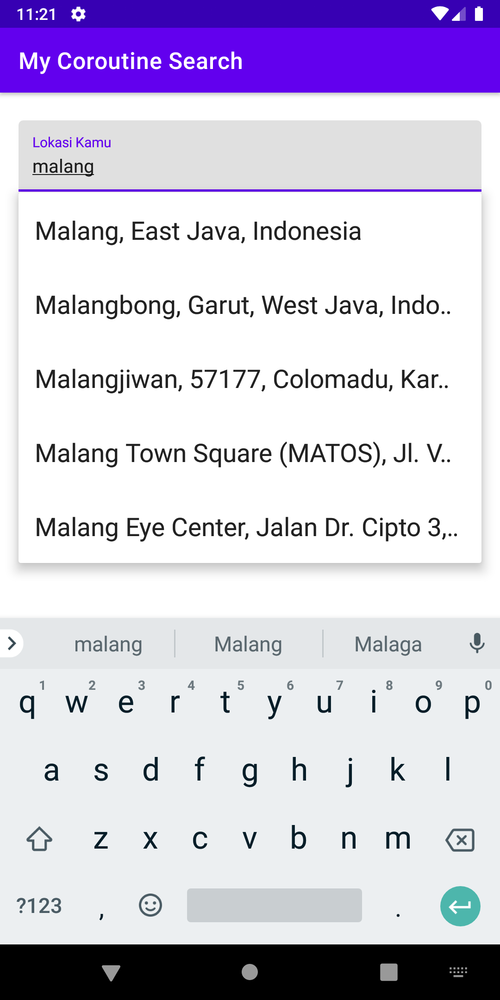

## Add Default gradle.properties
Add this code in root project before install this apps

org.gradle.jvmargs=-Xmx1536m  
android.useAndroidX=true  
android.enableJetifier=true  
kotlin.code.style=official  

## ScreenShot

